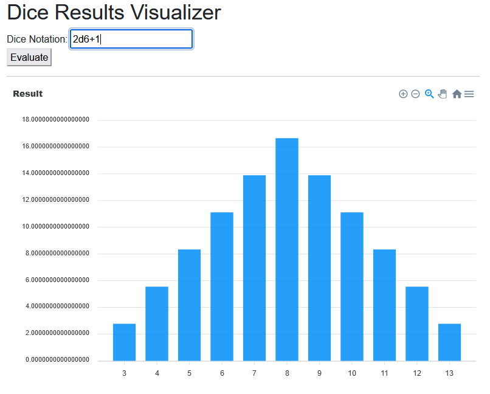

# Dice Results Visualizer

A simple website to parse standard dice notation and calculate the probability of each result, then visualize it.

Basically, [AnyDice](https://anydice.com/) but not featured. Just a small personal project to play with blazor/webassembly, notation parsing, and data viz. 